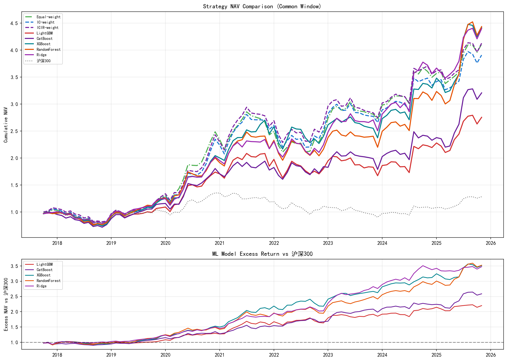

# A 股多因子选股研究系统

> 基于静态沪深 300 股票池的月频多因子研究流程，覆盖因子构建、统计检验、组合回测、机器学习模型横向比较和风控消融实验。



---

## 最终口径

- 股票池：静态沪深 300 成分股名单
- 调仓频率：月频调仓
- 传统多因子区间：`2015-07 ~ 2025-11`，共 125 个月
- 机器学习 walk-forward 区间：`2017-10 ~ 2025-11`，共 98 个月
- 基准：`510300` ETF 累计净值 proxy

这是当前版本的**最终披露口径**。项目曾尝试重建沪深 300 历史成分股进出路径，但没有形成足够可靠的动态股票池流程，因此当前版本保留静态成分股名单，并**明确承认幸存者偏差**。

---

## 结果汇总

### 传统多因子组合

| 策略 | 年化收益 | Sharpe | 最大回撤 | 超额收益 | IR |
|---|---:|---:|---:|---:|---:|
| 等权合成 | 16.99% | 0.768 | -28.04% | 13.70% | 1.129 |
| IC 加权 | 17.10% | 0.785 | -26.69% | 13.77% | 1.189 |
| **ICIR 加权** | **17.90%** | **0.813** | **-26.63%** | **14.56%** | **1.223** |
| 沪深 300 / 510300 基准 | 3.19% | 0.184 | -33.24% | -- | -- |

### 机器学习增强

| 模型 | 年化收益 | Sharpe | 最大回撤 | 超额收益 | IR | 换手率 |
|---|---:|---:|---:|---:|---:|---:|
| LightGBM | 13.22% | 0.621 | -22.94% | 10.14% | 0.920 | 56.0% |
| CatBoost | 15.34% | 0.698 | -28.22% | 12.35% | 1.111 | 55.8% |
| XGBoost | 19.94% | 0.942 | -25.53% | 16.62% | 1.440 | 54.4% |
| **RandomForest** | **20.01%** | 0.926 | -22.94% | **16.68%** | 1.354 | 39.6% |
| **Ridge** | 19.89% | **0.994** | **-21.64%** | 16.49% | **1.657** | **31.1%** |

### TopRisk 风控消融

| 策略 | 年化收益 | Sharpe | 最大回撤 | Calmar |
|---|---:|---:|---:|---:|
| ICIR，不加过滤 | 18.96% | 0.940 | -24.01% | 0.790 |
| ICIR + TopRisk | 18.86% | 0.950 | -23.22% | 0.812 |
| Ridge，不加过滤 | 19.89% | 0.994 | -21.64% | 0.919 |
| Ridge + TopRisk | 18.15% | 0.905 | -19.81% | 0.917 |
| XGBoost，不加过滤 | 19.94% | 0.942 | -25.53% | 0.781 |
| XGBoost + TopRisk | 18.18% | 0.879 | -23.90% | 0.761 |

### TopRisk v1 与 v2 对比

| 策略 | 年化收益 | Sharpe | 最大回撤 | Calmar |
|---|---:|---:|---:|---:|
| ICIR，不加过滤 | 18.96% | 0.940 | -24.01% | 0.790 |
| **ICIR + TopRisk v1 等权** | **18.86%** | **0.950** | **-23.22%** | **0.812** |
| ICIR + TopRisk v2 IC 加权 | 16.39% | 0.802 | -24.36% | 0.673 |

当前解释：

- 传统多因子中，`ICIR-weight` 是当前版本最强的合成方式。
- 机器学习模型中，`RandomForest` 的年化收益最高，`Ridge` 的风险调整表现最好。
- TopRisk 更适合作为回撤控制层，而不是收益增强层。
- v2 风控 IC 加权方案弱于 v1 等权方案，因此当前正式版本保留 v1 等权方案。

---

## 方法论

### 数据设置

- 股票池：静态沪深 300 成分股名单
- 基准：510300 ETF 累计净值 proxy
- 原始数据源：AKShare
- 预测标签：`ret_next_month`
- 交易假设：月频 Top-N 等权组合，单边交易成本 0.3%

### 关键设计选择

| 问题 | 处理方式 |
|---|---|
| 基准收益被低估 | 用 510300 累计净值 proxy 替代价格指数 + 固定 2% 股息近似 |
| 复权价格不适合直接比较横截面市值 | 市值 proxy = `turnover / volume * outstanding_share` |
| 财务报表是年初至今累计口径 | TTM = `Q_t + Annual(Y-1) - Q_corr(Y-1)` |
| 财务数据前视偏差 | 因子构建工具中主要使用 `NOTICE_DATE` 做 point-in-time 对齐 |
| 极端值 | 使用 MAD 缩尾 |
| 行业集中暴露 | 使用申万一级行业哑变量做横截面行业中性化 |

### 机器学习 Walk-Forward

```text
训练 [24个月] | 验证 [3个月] | -> 预测下一期
              训练 [24个月] | 验证 [3个月] | -> 预测下一期
                           ...
```

默认机器学习横比不使用全样本调参，避免把未来信息带入模型选择。

---

## 重要局限

### 1. 幸存者偏差

当前版本使用的是**静态沪深 300 成分股名单**，而不是完整重建的历史成分股路径。这意味着：

- 后来才进入或长期留在沪深 300 的股票，可能会出现在更早期样本中；
- 被剔除的历史成分股没有被完整纳入；
- 因此回测结果属于**明确披露幸存者偏差的研究结果**，不是生产级无偏回测结果。

这个局限是主动披露的，而不是隐藏的。

### 2. 基准仍然是 proxy

当前基准使用 `510300` ETF 累计净值作为本地可得的全收益近似。相比旧版固定 2.0% 股息率近似，这个口径明显更合理，但仍然包含 ETF 跟踪误差和费率影响。

### 3. 交易摩擦仍然简化

当前没有建模停牌、涨跌停无法成交、市场冲击成本等更复杂的交易约束。

---

## 项目结构

```text
quant_training/
|-- data/
|   |-- download.py
|   |-- clean.py
|   `-- benchmark.py
|-- factors/
|   |-- utils.py
|   |-- value.py
|   |-- momentum.py
|   |-- quality.py
|   |-- volatility.py
|   |-- liquidity.py
|   |-- additional.py
|   |-- risk.py
|   `-- preprocess.py
|-- testing/
|   |-- ic_analysis.py
|   |-- quantile_backtest.py
|   `-- fama_macbeth.py
|-- portfolio/
|   |-- combine.py
|   |-- backtest.py
|   `-- performance.py
|-- ml/
|   `-- model_comparison.py
|-- analysis/
|   |-- compare_strategies.py
|   |-- ablation_top_risk.py
|   `-- ablation_risk_v2.py
`-- output/
```

---

## 快速运行

```bash
python data/download.py
python data/clean.py
python factors/value.py
python factors/momentum.py
python factors/quality.py
python factors/volatility.py
python factors/liquidity.py
python factors/additional.py
python factors/risk.py
python factors/preprocess.py
python testing/ic_analysis.py
python testing/quantile_backtest.py
python testing/fama_macbeth.py
python portfolio/backtest.py
python ml/model_comparison.py
python analysis/compare_strategies.py
python analysis/ablation_top_risk.py
python analysis/ablation_risk_v2.py
```

---

## 主要输出

关键结果文件：

- `output/analysis/performance_table.csv`
- `output/analysis/strategy_comparison.png`
- `output/ml/model_comparison.csv`
- `output/ml/model_comparison_nav.png`
- `output/ablation/performance_comparison.csv`
- `output/ablation/v2_performance.csv`

---

## 主要结论

1. 当前样本下，传统多因子 baseline 已经具备较强表现。
2. 在静态沪深 300 版本中，`RandomForest`、`XGBoost` 和 `Ridge` 在共同 ML 窗口内能够跑赢传统 baseline。
3. `Ridge` 在 Sharpe、IR、回撤和换手率维度上是最稳定的机器学习模型。
4. 基准低估问题已经通过切换到 510300 累计净值 proxy 得到修正。
5. 项目保留静态股票池版本，并**诚实披露幸存者偏差**，避免夸大回测严谨性。
