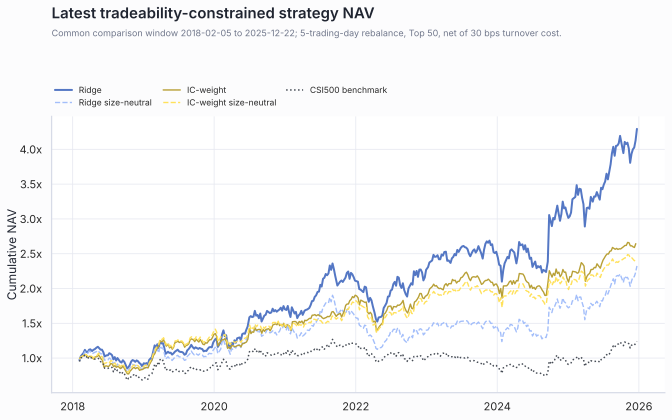
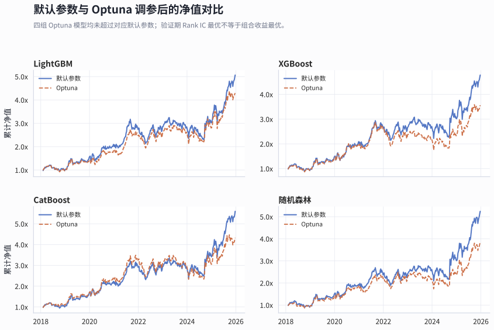
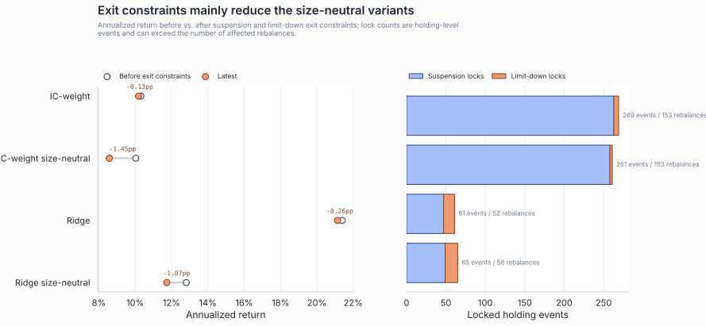

# CSI500 日频价量 Alpha：可交易约束版

> 基于静态中证 500 股票池的日频价量研究流程。当前版本重点不是追求更高的回测收益，而是把标签可得性、涨跌停、停牌和调仓执行放到同一套可复现口径中。



## 核心结论

- 当前 13 条策略均已按最新交易约束重跑。30 bps 成本下，`CatBoost` 表现最好：年化收益 **25.45%**、Sharpe **0.912**。
- `XGBoost` 最大回撤最低，为 **-27.90%**；`Ridge` 的收益略低，但平均换手只有 **35.45%**，明显低于树模型的 53%-61%。
- 四组 Optuna 模型都没有超过对应默认参数，说明验证期 Rank IC 最优不等于最终 Top 50 组合收益最优。
- 成本升至 60 bps 后，CatBoost 年化降至 **15.63%**，与 Ridge 的 **14.83%** 已较接近；树模型优势对交易成本较敏感。
- 执行网格识别出 **20,805** 条次日停牌/无报价记录和 **1,664** 条次日跌停不可卖记录。
- 结果仍受到静态成分股幸存者偏差影响；本地也缺少历史 ST / *ST 状态，因此这仍是研究型回测，不是生产级无偏结果。

---

## 最终披露口径

| 项目 | 当前口径 |
|---|---|
| 股票池 | 2026-05-09 静态中证 500 成分股，499 只股票有可用行情 |
| 原始行情区间 | 2015-01-05 至 2025-12-31 |
| 数据频率 | 日频 OHLCV、成交额、换手率和流通股本 |
| 信号时点 | 第 `t` 日收盘后 |
| 建仓时点 | 第 `t+1` 个市场交易日开盘 |
| 预测标签 | `open[t+6] / open[t+1] - 1`，即未来 5 个交易日开盘到开盘收益 |
| 调仓规则 | 每 5 个市场交易日调仓，Top 50 等权 |
| 交易成本 | 按组合换手扣除 30 bps |
| 模型训练 | Walk-forward，只使用调仓时点已经完整实现的历史标签 |
| 当前主结果 | IC 组合、Ridge/RidgeCV、四类默认树模型及四类 Optuna 模型 |

绩效表使用各策略自身的有效 walk-forward 区间：IC 组合 472 个调仓期，其余机器学习模型 383 个调仓期。顶部净值图为了横向可比，统一使用 2018-02-05 至 2025-12-22 的共同区间。

---

## 最新结果

以下两张表共同构成当前版本的主结果。所有数字均已包含：

- 标签可得性修复；
- 次日涨停、停牌和新股买入过滤；
- 次日跌停或停牌时无法卖出的锁仓约束；
- 30 bps 换手成本。

### 线性与 IC 基线

| 策略 | 年化收益 | 年化波动 | Sharpe | 最大回撤 | 平均换手 | 锁仓调仓次数 |
|---|---:|---:|---:|---:|---:|---:|
| IC-weight | 10.19% | 19.62% | 0.519 | -34.55% | 36.32% | 153 |
| IC-weight size-neutral | 8.58% | 19.33% | 0.444 | -33.41% | 37.38% | 153 |
| Ridge | 21.14% | 26.67% | 0.793 | -35.37% | 35.45% | 52 |
| Ridge size-neutral | 11.74% | 25.77% | 0.456 | -40.86% | 43.71% | 56 |
| RidgeCV | 20.96% | 26.65% | 0.786 | -35.25% | 35.44% | 52 |

### 树模型与 Optuna

| 策略 | 年化收益 | 年化波动 | Sharpe | 最大回撤 | 平均换手 | 锁仓调仓次数 |
|---|---:|---:|---:|---:|---:|---:|
| LightGBM | 23.80% | 27.99% | 0.850 | -32.85% | 58.72% | 63 |
| XGBoost | 22.86% | 28.48% | 0.803 | **-27.90%** | 58.10% | 64 |
| **CatBoost** | **25.45%** | 27.90% | **0.912** | -29.33% | 54.02% | 56 |
| RandomForest | 24.37% | 30.08% | 0.810 | -29.37% | 53.52% | 54 |
| LightGBM Optuna | 21.13% | 28.19% | 0.750 | -29.36% | 60.81% | 62 |
| XGBoost Optuna | 18.18% | 27.83% | 0.653 | -38.99% | 60.51% | 64 |
| CatBoost Optuna | 21.24% | 28.21% | 0.753 | -33.23% | 55.51% | 47 |
| RandomForest Optuna | 19.32% | 28.43% | 0.680 | -30.37% | 55.27% | 58 |



### 成本敏感性

下表只比较五条代表性默认参数模型的年化收益。树模型换手更高，因此成本上升时衰减更快。

| 策略 | 30 bps | 60 bps | 100 bps |
|---|---:|---:|---:|
| Ridge | 21.14% | 14.83% | **6.91%** |
| LightGBM | 23.80% | 13.31% | 0.67% |
| XGBoost | 22.86% | 12.55% | 0.12% |
| CatBoost | **25.45%** | **15.63%** | 3.71% |
| RandomForest | 24.37% | 14.73% | 3.01% |

### 交易约束版本影响



该图保留 2026-06-07 首轮验证的四条代表路径，用于说明市值中性版本对锁仓更敏感。图中锁仓事件按持仓计数，同一次调仓可能有多只股票被锁，因此事件数可以大于受影响的调仓次数。

### 如何理解结果

1. 30 bps 假设下，CatBoost 是当前收益和 Sharpe 最好的模型；XGBoost 的最大回撤最低。
2. Ridge 与 RidgeCV 几乎一致，说明交叉验证选择正则强度没有带来明显组合收益改善。
3. 四组 Optuna 版本全部落后于默认参数，当前调参目标需要进一步改成更贴近组合收益、换手和回撤的联合目标。
4. 树模型的平均换手约为 Ridge 的 1.5-1.7 倍，因此更依赖低交易成本假设。
5. 相对 2026-05-27 版本的变化同时包含全市场日历执行收益修复和卖出锁仓约束，不能把版本前后的收益差全部归因于某一项约束。

---

## 研究流程


```mermaid
flowchart LR
    A["日频 OHLCV"] --> B["价量特征"]
    B --> C["横截面缩尾与标准化"]
    C --> D["Point-in-time 标签与训练窗口"]
    D --> E["IC / 线性模型 / 树模型打分"]
    E --> F["次日买入过滤"]
    F --> G["停牌或跌停持仓锁定"]
    G --> H["剩余名额选 Top 50"]
    H --> I["扣除换手成本"]
```

### 日频特征

| 类别 | 特征 |
|---|---|
| 短期反转 | `REV_1D` |
| 动量 | `MOM_5D`, `MOM_20D`, `MOM_60D` |
| 波动率 | `VOL_20D`, `RANGE_20D` |
| 流动性 | `TURN_5D`, `TURN_20D`, `AMIHUD_20D`, `VOLUME_RATIO_5_20` |
| 价格偏离 | `BIAS_20` |
| 风险与规模 | `SIZE`, `BETA_60D` |
| 增量价量信号 | `VOLUME_PRICE_REVERSAL_20D` |

所有特征按每日横截面做 1% / 99% 缩尾和 z-score 标准化。

### 标签可得性

目标收益使用：

```python
ret_fwd_5d = open[t + 6] / open[t + 1] - 1
```

在调仓日 `T` 收盘做决策时，只允许使用满足以下条件的训练样本：

```text
t + horizon + 1 <= T
```

Optuna 内部训练集和验证集之间额外留出 `horizon` 个交易日 embargo，避免两侧标签区间重叠。

### 交易约束

| 场景 | 当前处理 |
|---|---|
| 次日涨停 | 不允许买入；主板按约 10%，创业板/科创板按约 20% 阈值识别 |
| 次日停牌或无报价 | 不允许买入 |
| 上市不足 120 个有效交易日 | 不允许买入 |
| 已持仓股票次日跌停 | 无法卖出，强制继续持有并占用组合名额 |
| 已持仓股票次日停牌 | 无法卖出，强制继续持有并占用组合名额 |
| 停牌期间估值 | 使用最近可用价格盯市 |
| 剩余组合名额 | 从当期可买股票中按分数补足 |

原始数据会省略大部分停牌日，因此流水线先按全市场交易日历补齐每只股票的执行网格，再判断买入、卖出和持有状态。这样不会再由单股票 `shift()` 直接跨过停牌期。

---

## 版本演进

README 只展示当前最终口径。历史数字和修复过程保留在审计报告中，不再混入主结果表。

| 阶段 | 修复内容 | 文档 |
|---|---|---|
| 第一轮 | 修复训练窗口使用尚不可知未来标签的问题 | [`NO_LEAKAGE_FIX_REPORT.md`](NO_LEAKAGE_FIX_REPORT.md) |
| 第二轮 | 增加 Optuna embargo、次日涨停/停牌和新股买入过滤 | [`LEAKAGE_REVIEW_AND_TRADEABILITY_FIX.md`](LEAKAGE_REVIEW_AND_TRADEABILITY_FIX.md) |
| 当前版本 | 按市场日历处理停牌，并增加跌停/停牌无法卖出的锁仓状态 | [`CSI500_DAILY_TRADE_CONSTRAINT_FIX_REPORT.md`](CSI500_DAILY_TRADE_CONSTRAINT_FIX_REPORT.md) |
| 全模型补跑 | 在当前交易约束面板上重跑 RidgeCV、四类树模型和四类 Optuna 模型 | [`CSI500_DAILY_ML_TRADE_CONSTRAINT_RERUN.md`](CSI500_DAILY_ML_TRADE_CONSTRAINT_RERUN.md) |

`output/csi500/daily_alpha/` 根目录下的 2026-05-27 CSV 保留用于历史复现；当前最终结果统一位于 `trade_constraint_validation/`，README 不再混用两个版本。

---

## 重要局限

### 1. 静态股票池

`data/raw/csi500/index_constituents.csv` 是 2026-05-09 的静态名单，不是历史成分股进出记录。当前回测可能：

- 把后来才进入中证 500 的股票放入更早期样本；
- 漏掉历史上曾经属于中证 500、但当前已被剔除的股票；
- 高估长期收益和相对基准表现。

### 2. 缺少历史 ST / *ST 状态

本地行情没有 `is_st`、历史证券简称或证券状态字段。当前静态成分股名称中没有 ST 股票，但不能据此推断 2015-2025 年的历史状态。

因此当前版本没有伪造 ST 过滤。要补齐该约束，需要按交易日提供：

```text
stock_code, date, is_st
```

### 3. 涨跌停是近似识别

本地没有交易所官方涨停价和跌停价。当前按板块、日期和前收盘价近似判断 10% / 20% 涨跌停，无法覆盖所有特殊证券和价格取整细节。

### 4. 交易成本仍然简化

当前只按换手扣除固定 30 bps，没有单独建模冲击成本、盘口深度、佣金最低收费和卖出印花税变化。

---

## 运行方式

准备好 CSI500 原始行情和基准数据后运行：

```powershell
$env:QT_UNIVERSE = "csi500"
$env:QT_FACTOR_SET = "full"

python csi500_daily_alpha_pipeline.py `
  --horizon 5 `
  --top-n 50 `
  --run-all-ml `
  --run-all-ml-optuna `
  --optuna-trials 12 `
  --optuna-val-days 63 `
  --optuna-retune-every 25 `
  --lgbm-max-train-rows 50000
```

运行最小交易约束测试：

```powershell
python -m unittest testing.test_daily_trade_constraints -v
```

重新生成 README 图表：

```powershell
python analysis/plot_csi500_tradeability_readme.py
```

如果最新交易约束面板已经存在，只续跑机器学习模型和汇总表：

```powershell
python analysis/run_csi500_trade_constraint_ml.py `
  --models all `
  --max-train-rows 50000 `
  --optuna-trials 12 `
  --optuna-val-days 63 `
  --optuna-retune-every 25 `
  --cost-scenarios-bps 30,60,100
```

---

## 关键文件

```text
quant_training/
|-- csi500_daily_alpha_pipeline.py
|-- testing/
|   `-- test_daily_trade_constraints.py
|-- analysis/
|   |-- plot_csi500_tradeability_readme.py
|   `-- run_csi500_trade_constraint_ml.py
|-- docs/readme_assets/
|   |-- csi500_daily_latest_nav.svg
|   |-- csi500_ml_default_vs_optuna.svg
|   `-- csi500_tradeability_impact.svg
|-- output/csi500/daily_alpha/
|   `-- trade_constraint_validation/
|-- NO_LEAKAGE_FIX_REPORT.md
|-- LEAKAGE_REVIEW_AND_TRADEABILITY_FIX.md
|-- CSI500_DAILY_TRADE_CONSTRAINT_FIX_REPORT.md
`-- CSI500_DAILY_ML_TRADE_CONSTRAINT_RERUN.md
```

关键输出：

- `output/csi500/daily_alpha/trade_constraint_validation/performance_all_models.csv`
- `output/csi500/daily_alpha/trade_constraint_validation/performance_before_after_all_models.csv`
- `output/csi500/daily_alpha/trade_constraint_validation/cost_sensitivity_all_models.csv`
- `output/csi500/daily_alpha/trade_constraint_validation/constraint_coverage.csv`
- `output/csi500/daily_alpha/trade_constraint_validation/*_returns.csv`

---

## 当前定位

这个分支展示的是一套逐步收紧交易假设后的 CSI500 日频研究框架：

- 收益不再建立在近端标签泄漏上；
- 买入端不再假设涨停或停牌股票可以买到；
- 卖出端不再假设跌停或停牌股票可以立即卖出；
- 所有线性模型、树模型和 Optuna 版本使用同一套执行约束；
- 对仍缺失的历史成分股和 ST 数据明确披露，而不是用不可靠代理掩盖。

当前最可信的结论不是“CatBoost 能稳定获得 25% 收益”，而是：在这份带有静态股票池偏差的数据上，默认 CatBoost 在 30 bps 成本假设下领先，Ridge 对成本上升更稳健，而现有 Optuna 目标没有转化成更好的组合表现。所有结论仍需在历史动态成分股、ST 状态和更真实冲击成本补齐后重新验证。
